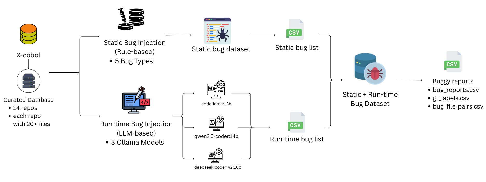
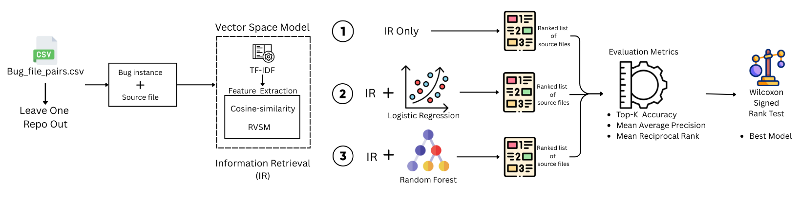

# COBug: A Bug Localization Pipeline for COBOL — Does It Work? An Exploratory Study
---
## **1. Project Overview**

COBug is a bug localization pipeline designed specifically for **COBOL**, a legacy programming language that is still widely used in mission-critical systems, such as those in **banking**, **finance**, and **government** sectors. COBug combines **static** and **runtime bug injection** methods with **Information Retrieval (IR)** and **Machine Learning (ML)** techniques to localize bugs in COBOL codebases. This project uses **14 curated COBOL repositories** from the **X-COBOL corpus** and applies controlled bug injection using **rule-based transformations** and **Large Language Models (LLMs)**.

### **Abstract**:
- The primary goal of COBug is to enable **automatic bug localization** for COBOL systems using a **dataset of controlled bug injections** (both static and runtime).
- The pipeline utilizes **static bug injections** (e.g., rule-based transformations) and **runtime bug injections** (using LLMs like **Qwen2.5-Coder**, **CodeLLaMA**, **DeepSeek-Coder-V2**).
- **COBug** establishes the first **empirical baseline** for COBOL bug localization.

---

## **2. Setup and Installation**

### **System Requirements**:
- **Python**: Version 3.8 or higher
- **Dependencies**: Listed in `requirements.txt`.

### **Installation Steps**:

1. **Clone the Repository**:
   ```bash
   git clone https://github.com/your-repo/COBug.git
   cd COBug
2. **Set Up a Virtual Environment**:
   ```bash
   python3 -m venv venv
   source venv/bin/activate  # Linux/Mac
   venv\Scripts\activate     # Windows

3. **Install Dependencies**:
   ```bash
    pip install -r requirements.txt

4. **Prepare Datasets**:
    Place your COBOL code repositories (X-COBOL corpus) in the X-COBOL_files/ directory.
---

### **3. Visualizations (Pipeline Diagrams)**
Dataset Creation 


Pipeline of COBug Tool 


Explanation: The pipeline involves several steps, from bug injection to evaluation. The main flow is:

Static Bug Injection → Runtime Bug Injection → CSV Creation → Localization Pipeline → Evaluation → Results Analysis


---

### **4. Bug Injection Process**
1. **Static Bug Injection**:
Step-1
Execute:
     ```bash
    python static_bug_injector.py
Code File: static_bug_injector.py

Purpose: This script injects static bugs into COBOL files using rule-based transformations such as:

Unused data items

Redundant GOTO statements

Missing ELSE for critical checks

Undeclared identifier references

Execution:

The script processes the COBOL files in the X-COBOL_files/ directory and applies the bug transformations.

The static bugs are logged in a CSV file, ensuring compliance with the dataset structure.

Output Files:

Injected COBOL files: Stored in buggy_repos_static/.

Static bug logs: static_bug_dataset.csv.

2. **Runtime Bug Injection**:
Step-2
Execute:
    ```bash
   python runtime_bug_injector.py
Code File: runtime_bug_injector.py

Purpose: This script injects runtime bugs into COBOL files using LLM models:

**Qwen2.5-Coder** (qwen2.5-coder:14b)

**CodeLLaMA** (codellama:13b)

**DeepSeek-Coder** (deepseek-coder-v2:16b)

Execution:

The script applies bugs that manifest only under specific runtime conditions, such as infinite loops, divide-by-zero, and missing file status handling.

The model outputs are stored as runtime-injected files.

Output Files:

Injected COBOL files: Stored in buggy_repos_runtime_final/.

Runtime bug logs: runtime_bug_injector_logs.csv.

---

### **5. CSV Creation for Bug Reports**
Step-3
Execute:
   
    python build_benchmark_csv.py

Code File: build_benchmark_csv.py

Purpose: Generates benchmark CSVs after bug injection.

Execution:

This script consolidates the bug reports and ground truth into three essential CSV files:

bug_reports.csv: Contains the generated bug reports with symptoms and descriptions.

gt_labels.csv: Maps bug IDs to the faulty file paths (ground truth).

bug_file_pairs.csv: Contains the relationship between the injected bugs and files.

---

### **6. COBug Localization Pipeline**
Step-4
Execute:

    python full_pipeline.py
Code File: full_pipeline.py

Purpose: Runs the entire bug localization pipeline, integrating bug injection, IR-based ranking, and ML-based re-ranking.

Process:

Bug Report Generation:

Symptom-based reports are generated using predefined templates to avoid data leakage.

IR-Based Localization:

TF-IDF vectors are created for both bug reports and COBOL files.

Cosine similarity is used to rank files by their relevance to the bug reports.

ML Re-Ranking:

Logistic Regression (IR+LR) and Random Forest (IR+RF) are used for re-ranking the IR results based on supervised training data.

Cross-Repository Evaluation:

The pipeline uses a Leave-One-Repository-Out (LORO) strategy to evaluate the models' generalization across multiple COBOL repositories.

Output Files:

evaluation_results.csv: Ranking results of the files for each bug.

metrics_summary.csv: Summarizes evaluation metrics like Top-K accuracy, MAP, and MRR for each model.

---

### **7. Manual Checking**
Step-5
Execute:

    python run_manual_audit_stats.py
Code File: run_manual_audit_stats.py

Purpose: Allows for manual inspection and auditing of bug injections and results.

Execution:

It can be used to verify that the injected bugs and generated reports meet the expectations and do not introduce unintended errors.

Output:

manual_audit_results.csv: Contains logs of the manual checks for each injected bug.

---
### **8. Evaluation and Results**
Step-6
Execute:

    python analyze_results.py
Code File: analyze_results.py

Purpose: Analyzes the evaluation results and compares model performance.

Process:

The evaluation metrics (e.g., Top-K, MAP) are calculated and compared between different models.

Wilcoxon signed-rank tests are used to statistically assess the differences between models.

Output Files:

best_model_summary.csv: Summary of the best-performing models across repositories.

repo_win_counts.csv: Counts of how many times each model was the best.

model_rankings.csv: Ranking of models based on their evaluation metrics.

final_observations.txt: Contains final observations and conclusions from the analysis.

---
### **9. Analyzing the Results**
Runtime Bug Results:
After running the evaluation, the runtime bug results for each of the models (Qwen2.5-Coder, CodeLLaMA, DeepSeek-Coder) are stored in the tables/ folder.

These results are summarized in CSV files (e.g., results_qwen.csv, results_codellama.csv, results_deepseek.csv), detailing the performance metrics like Top-K accuracy, MAP, and MRR.

---
### **10. Final Observations and Future Work**
**Conclusion**:
COBug establishes a first empirical baseline for COBOL bug localization.

IR-based models consistently provide a solid baseline, with an average MAP of 0.15–0.16.

ML re-ranking showed no consistent improvement and sometimes degraded performance.

Qwen2.5-Coder consistently performed best across different repositories.

COBOL-specific challenges were observed, such as verbose syntax and cross-file dependencies, which limit the effectiveness of text-based localization.

**Future Work**:
COBOL-aware models that understand COBOL’s unique syntax and structure.

Hybrid approaches that combine IR and ML based on bug report characteristics.

Pretraining LLMs for COBOL to better understand its structure.

---

**Final Remarks**:
This README provides a comprehensive guide to COBug, explaining all aspects of bug injection, the pipeline, and evaluation. It is structured to give reviewers a clear understanding of the process, with all relevant file names and output files.
